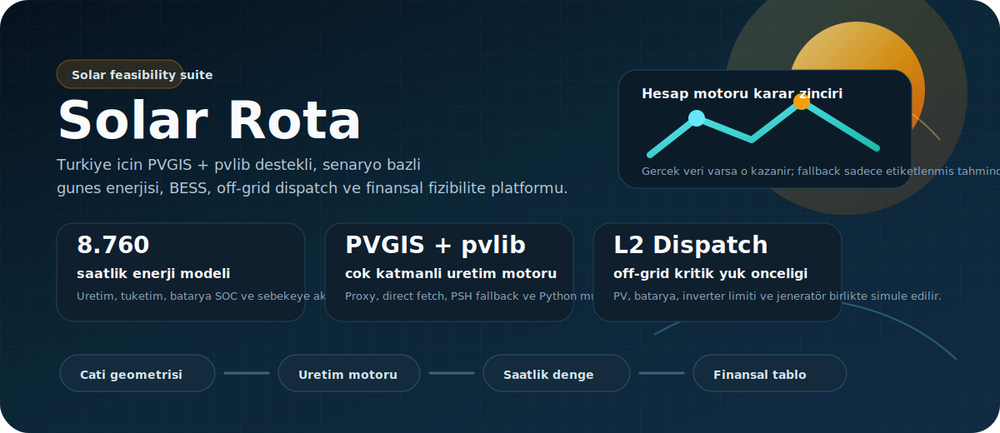
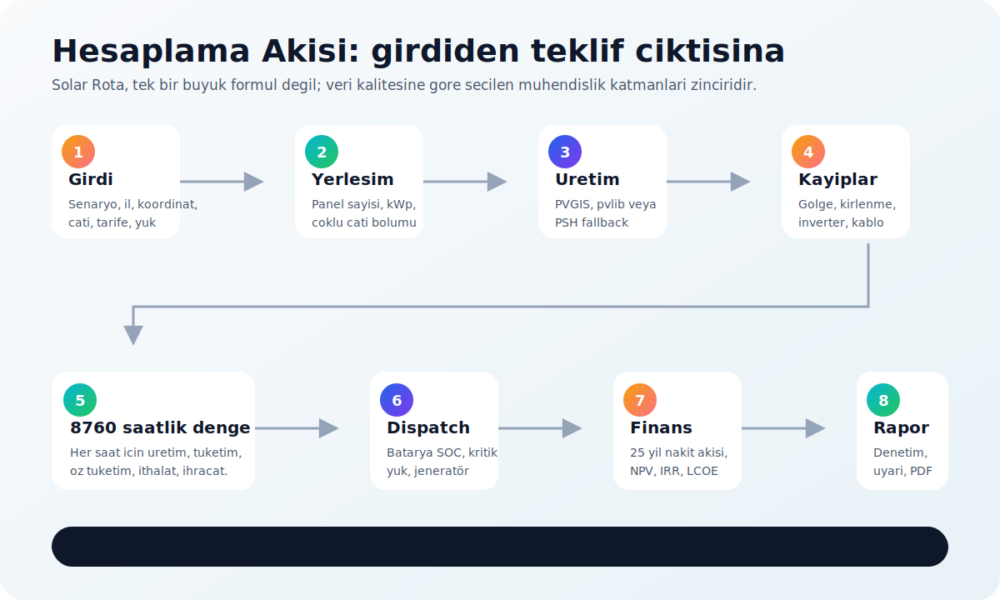
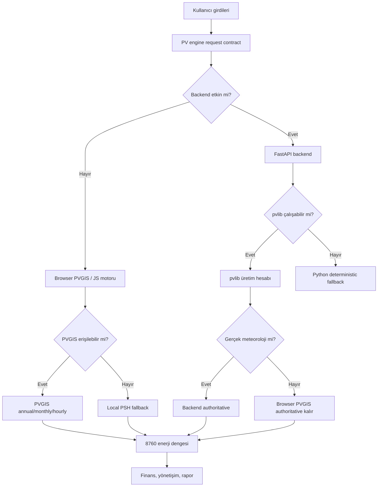
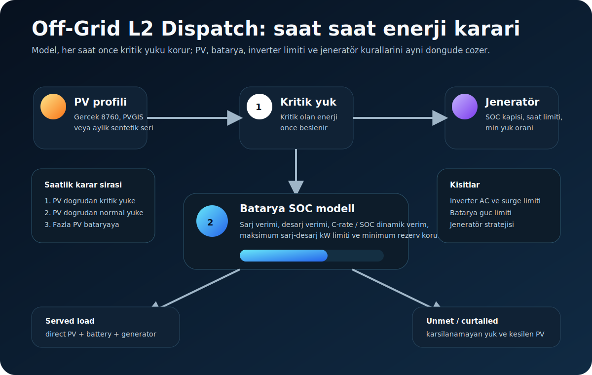
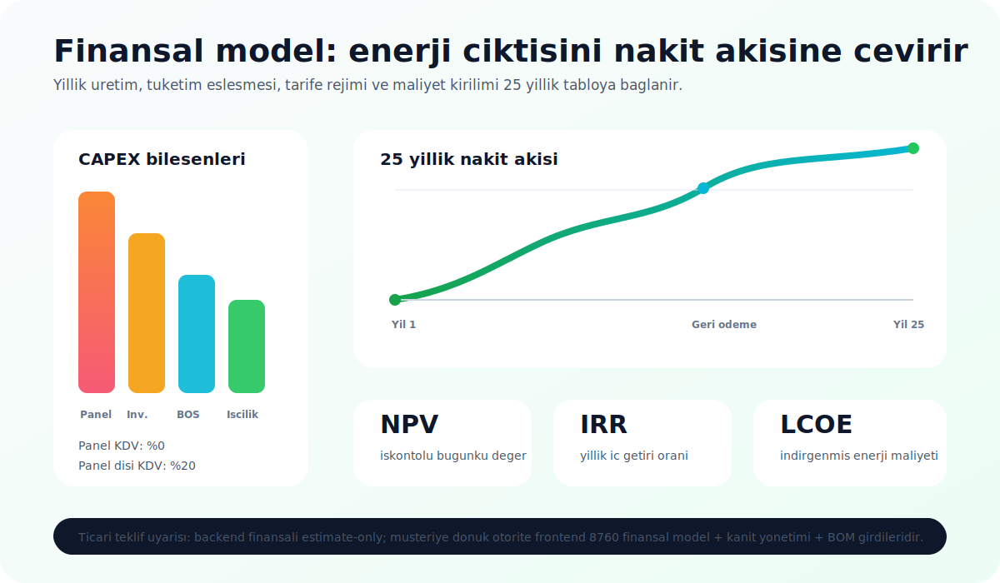

# Solar Rota

<p align="center">
  
</p>

<p align="center">
  <a href="./package.json"></a>
  
  
  
  
</p>

Solar Rota, Türkiye odaklı bir güneş enerjisi ön fizibilite ve teklif hazırlama platformudur. Çatı geometrisi, panel/inverter seçimi, canlı güneş verisi, batarya, off-grid jeneratör, tarife rejimi ve 25 yıllık finansal tabloyu aynı hesaplama zincirinde birleştirir.

Bu repo tek bir "panel sayısı x yıllık ışınım" hesabı değildir. Uygulama, veri kalitesine göre farklı motorları devreye alır:

- Tarayıcı tarafında PVGIS proxy/direct fetch + yerel PSH fallback.
- Python tarafında FastAPI + pvlib hazır mühendislik servisi.
- On-grid için 8.760 saatlik üretim/tüketim/şebeke dengesi.
- Off-grid için kritik yük öncelikli L2 dispatch, batarya SOC, jeneratör ve stres senaryoları.
- 25 yıllık finansal model, NPV, IRR, LCOE, KDV ayrımı, O&M, sigorta ve ekipman yenilemeleri.
- Kanıt/güven yönetişimi: gerçek saatlik veri, saha importları, kabul ve operasyon kapıları.

> Önemli: Solar Rota bir ön fizibilite ve mühendislik destek aracıdır. Nihai uygulama projesi, bağlantı görüşü, statik inceleme, saha keşfi ve yetkili mühendis onayı yerine geçmez.

## İçindekiler

- [Ne İşe Yarar?](#ne-i̇şe-yarar)
- [Hesaplama Mimarisi](#hesaplama-mimarisi)
- [Ana Akış](#ana-akış)
- [1. Girdi ve Veri Sözleşmesi](#1-girdi-ve-veri-sözleşmesi)
- [2. Çatı ve Panel Yerleşimi](#2-çatı-ve-panel-yerleşimi)
- [3. Üretim Motorları](#3-üretim-motorları)
- [4. Kayıp Zinciri](#4-kayıp-zinciri)
- [5. Saatlik On-Grid Enerji Dengesi](#5-saatlik-on-grid-enerji-dengesi)
- [6. Off-Grid L2 Dispatch](#6-off-grid-l2-dispatch)
- [7. Finansal Model](#7-finansal-model)
- [8. Panel Datasheet ve Termal String Kontrolü](#8-panel-datasheet-ve-termal-string-kontrolü)
- [9. Türkiye Tarife ve Regülasyon Katmanı](#9-türkiye-tarife-ve-regülasyon-katmanı)
- [10. Kanıt, Güven ve Raporlama](#10-kanıt-güven-ve-raporlama)
- [API](#api)
- [Kurulum](#kurulum)
- [Testler](#testler)
- [Repo Haritası](#repo-haritası)
- [Sınırlamalar](#sınırlamalar)

## Ne İşe Yarar?

Solar Rota'nın hedefi, farklı kullanıcı senaryolarında hızlı ama izlenebilir bir karar zemini üretmektir.

| Senaryo | Uygulamanın hesapladığı ana konu | Kritik fark |
|---|---|---|
| On-grid | Çatı üretimi, öz tüketim, şebekeye ihracat, geri ödeme | PVGIS/8760 üretim-tüketim eşleştirmesi |
| Off-grid | PV + batarya + jeneratör ile yük karşılama | Kritik yük öncelikli dispatch ve SOC takibi |
| Tarımsal sulama | Sezonluk pompa yükü ve üretim penceresi | 365 gün düz tüketim yerine sulama sezonu |
| Isı pompası | Isıtma/soğutma ek elektrik yükü | COP/SPF tabanlı mevsimsel yük |
| EV şarj | Araç tüketimi ve şarj saat profili | Gündüz/gece şarj davranışı |
| Mobil/off-grid | Kompakt bağımsız sistem | Depolama ve özerklik odaklı çıktı |

## Hesaplama Mimarisi

<p align="center">
  
</p>

Temel prensip şudur:

> Bir hesap koşusunda tek bir otoriter üretim kaynağı kullanılır. Backend, PVGIS, kullanıcı saatlik verisi veya fallback sonuçları birbirine sessizce karıştırılmaz. Hangi kaynak kullanıldıysa sonuç nesnesinde metadata olarak taşınır.

Bu prensip [js/calculation-service.js](./js/calculation-service.js), [js/pv-engine-contracts.js](./js/pv-engine-contracts.js), [js/calc-engine.js](./js/calc-engine.js) ve [backend/engines/production_router.py](./backend/engines/production_router.py) arasında uygulanır.



## Ana Akış

1. Kullanıcı senaryoyu seçer: on-grid, off-grid, sulama, ısı pompası, EV vb.
2. Konum ve çatı geometrisi alınır: il, koordinat, poligon, alan, eğim, azimut.
3. Panel, inverter ve gerekiyorsa batarya/jeneratör seçilir.
4. Tüketim girilir: günlük, aylık, 8.760 saatlik profil veya off-grid cihaz listesi.
5. Tarife, ihracat bedeli, dağıtım bedeli, SKTT/kontrat modu ve finansal varsayımlar alınır.
6. Üretim motoru çalışır: PVGIS proxy/direct, Python backend veya fallback.
7. Kayıp zinciri uygulanır: gölge, kirlenme, bifacial, inverter, kablo, sıcaklık.
8. Saatlik enerji dengesi kurulur: self-consumption, import, export, batarya akışları.
9. Off-grid ise L2 dispatch çalışır: kritik yük, batarya SOC, jeneratör, kötü hava, stres.
10. 25 yıllık finansal tablo ve güven/yönetişim çıktıları oluşturulur.

## 1. Girdi ve Veri Sözleşmesi

Frontend ve backend aynı sözleşmeyle konuşur:

- Sürüm: `GH-PV-ENGINE-CONTRACT-2026.04-v1`
- Frontend üretici: [js/pv-engine-contracts.js](./js/pv-engine-contracts.js)
- Backend model: [backend/models/engine_contracts.py](./backend/models/engine_contracts.py)

Sözleşme şu blokları taşır:

| Blok | İçerik |
|---|---|
| `scenario` | Senaryo anahtarı, etiket, teklif tonu |
| `site` | Enlem, boylam, şehir, GHI, timezone |
| `roof` | Alan, eğim, azimut, gölge, kirlenme, geometri |
| `system` | Panel Wp, panel alanı, sıcaklık katsayısı, inverter verimi, kablo kaybı, batarya |
| `load` | Günlük/aylık/saatlik tüketim, off-grid kritik yük, cihaz listesi |
| `offgrid` | Jeneratör, kötü hava, saha garanti ve dispatch ayarları |
| `tariff` | İthalat/ihracat birim fiyatı, dağıtım bedeli, SKTT/kontrat modu |
| `governance` | Kanıt kayıtları, teklif onayı, saha importları |
| `parity` | Frontend/backend kaynak karşılaştırma notları |

Bu yapı sayesinde panel Wp, panel alanı, inverter verimi ve kablo kaybı gibi değerler iki farklı motorda gizli default olarak yeniden icat edilmez; açıkça taşınır.

## 2. Çatı ve Panel Yerleşimi

Çatı tarafı iki katmandan oluşur:

- Harita/poligon geometrisi: [js/roof-geometry.js](./js/roof-geometry.js)
- Panel yerleşim hesabı: [js/calc-core.js](./js/calc-core.js)

### Poligon hesabı

Kullanıcı haritada çatı poligonu çizer. Uygulama:

- Noktaları lokal metre koordinatlarına dönüştürür.
- Shoelace formülüyle alanı hesaplar.
- Kenar uzunluklarından dominant çatı yönünü tahmin eder.
- Azimut katsayısını üretir.
- Çatı merkezini konum olarak kaydeder.

Basitleştirilmiş formül:

```text
usableAreaM2 = roofAreaM2 * usableRoofRatio
panelCount   = floor(usableAreaM2 / panelAreaM2)
systemPower  = panelCount * panelWattPeak / 1000
```

Çoklu çatı modunda her yüzey ayrı hesaplanır:

```text
totalPanelCount = sum(section.panelCount)
totalPowerKwp   = sum(section.systemPower)
```

Her yüzey kendi alanı, eğimi, azimutu ve gölge oranıyla üretim hesabına girer.

### Tüketime göre boyutlandırma

`designTarget = bill-offset` seçilirse sistem çatıyı tamamen doldurmak yerine yıllık tüketim hedefini baz alır.

```text
targetSpecificYield = clamp(ghi * 0.85, 900, 1800)
targetPanelCount    = ceil((annualLoadKwh / targetSpecificYield) * 1000 / panelWattPeak)
```

Bu, özellikle küçük tüketimli konutlarda gereksiz büyük sistem önerisini engeller.

## 3. Üretim Motorları

Solar Rota'da üretim hesabı üç ana yoldan yapılır.

### 3.1 Browser PVGIS / JS motoru

Ana üretim yolu [js/calc-engine.js](./js/calc-engine.js) içindedir.

Veri alma sırası [js/pvgis-fetch.js](./js/pvgis-fetch.js) tarafından yönetilir:

1. Backend PVGIS proxy: `/api/pvgis-proxy`
2. Direct PVGIS endpointleri: `PVcalc` ve opsiyonel `seriescalc`
3. Local PSH fallback

PVGIS isteğinde:

```text
lat         = site latitude
lon         = site longitude
peakpower   = sectionPowerKwp
loss        = 0
angle       = roof tilt
aspect      = azimuth - 180
```

`loss = 0` bilinçli bir tercihtir. Çünkü Solar Rota gölge, kirlenme, inverter, kablo ve bifacial etkileri kendi kayıp zincirinde izlenebilir şekilde uygular.

PVGIS başarılı olursa:

- `rawEnergy` yıllık üretim bazını verir.
- `rawMonthly` aylık dağılımı verir.
- `rawHourly` alınabilirse 8.760 saatlik profile normalize edilir.

PVGIS başarısız olursa fallback:

```text
rawEnergy = sectionPowerKwp * cityPsh * 365 * 0.92
rawPoa    = cityPsh * 365
```

Buradaki `0.92`, açık kayıp zincirinde tekrar sayılmayan residual mühendislik marjıdır.

### 3.2 Python pvlib backend

Backend servis [backend/main.py](./backend/main.py) ile açılır ve route'lar [backend/api/routes.py](./backend/api/routes.py) içinde tanımlıdır.

Ana üretim yönlendirici:

- [backend/engines/production_router.py](./backend/engines/production_router.py)
- [backend/engines/pvlib_engine.py](./backend/engines/pvlib_engine.py)
- [backend/engines/simple_engine.py](./backend/engines/simple_engine.py)

pvlib yolu şu şartlarda çalışır:

- `pvlib` kurulu olmalı.
- Enlem/boylam geçerli olmalı.
- Kurulu güç pozitif olmalı.

pvlib motorunun yaptığı adımlar:

1. 8.760 saatlik temsil yılı oluşturur.
2. `pvlib.location.Location` ile lokasyon kurar.
3. Solar position hesaplar.
4. Ineichen clear-sky GHI/DNI/DHI üretir.
5. Şehir GHI hedefiyle clear-sky toplamını ölçekler.
6. `haydavies` transposition ile POA irradiance üretir.
7. Gölge, kirlenme, kablo ve bifacial faktörlerini uygular.
8. `sapm_cell` ile hücre sıcaklığı hesaplar.
9. `pvwatts_dc` ile DC üretim hesaplar.
10. Sabit inverter verimi ve AC cap ile AC enerjiye çevirir.
11. Saatlik, aylık ve yıllık enerji döndürür.

Backend pvlib çıktısı şu anda `weatherSource = clearsky-scaled-synthetic` etiketi taşır. Bu nedenle frontend, gerçek PVGIS verisi varken bu çıktıyı otomatik otorite yapmaz. Backend ancak gerçek meteoroloji kaynağı etiketiyle dönerse otoriter üretim kaynağı olabilir.

### 3.3 Python deterministic fallback

pvlib yoksa veya koordinat/kapasite uygun değilse [backend/engines/simple_engine.py](./backend/engines/simple_engine.py) çalışır.

Formül:

```text
baseEnergyKwh = systemPowerKwp * psh * 365
annualEnergy  = baseEnergy
              * shadingFactor
              * soilingFactor
              * inverterFactor
              * orientationFactor
              * bifacialFactor
              * wiringFactor
```

Fallback, Türkiye'nin 81 ili için PSH değerleri içerir. Bilinmeyen şehir için varsayılan `4.50` PSH kullanılır.

## 4. Kayıp Zinciri

Kayıplar tek bir siyah kutu oranı değildir. Solar Rota kayıp nedenlerini ayrı ayrı taşır.

| Kayıp / kazanç | Ne zaman uygulanır? | Kaynak |
|---|---|---|
| Sıcaklık düzeltmesi | PSH fallback yolunda yıllıklaştırılmış derate | `resolveProductionTemperatureAdjustment` |
| Azimut/eğim | Fallback yolunda, PVGIS kendi geometri modelini kullandığı için PVGIS'te tekrar uygulanmaz | `_getTiltCoeff`, `azimuthCoeff` |
| Manuel gölge | Kullanıcı/saha tahmini | `state.shadingFactor` |
| OSM gölge | OpenStreetMap çevre bina verisi ile tahmin | `osmShadowFactor` |
| Kirlenme | Kullanıcı girişi | `soilingFactor` |
| Bifacial kazanç | Bifacial panel + albedo + gölge düzeltmesi | panel spec |
| İnverter | Kısmi yük ağırlıklı yıllık verim | inverter profile |
| Kablo | Kullanıcı etkinleştirirse toplam kablo kaybı | cable loss |

OSM gölge tahmini yıllık düz oran olarak kullanılmaz; aylık üretim ağırlıklarıyla sezonlara göre ölçeklenir.

```text
winter multiplier = 2.0
spring multiplier = 1.0
summer multiplier = 0.5
autumn multiplier = 1.2
```

Bu, düşük kış güneşi nedeniyle uzayan gölgelerin yıllık hesaba daha gerçekçi yansımasını sağlar.

## 5. Saatlik On-Grid Enerji Dengesi

On-grid hesap [js/calc-core.js](./js/calc-core.js) içindeki `simulateHourlyEnergy` ile yapılır.

Her saat için:

```text
selfConsumption = min(production, load)
gridExport      = max(0, production - load)
gridImport      = max(0, load - production)
```

Saatlik üretim varsa doğrudan kullanılır. Yoksa aylık üretim, mevsimsel güneş profiline dağıtılır. Saatlik tüketim varsa kullanılır; yoksa aylık/günlük tüketim tarifeye uygun saatlik profile yayılır.

Sonuç olarak şu değerler oluşur:

- Yıllık üretim
- Yıllık tüketim
- Öz tüketim
- Şebeke ithalatı
- Fiziksel ihracat
- Ödenen/ödenmeyen ihracat
- Aylık mahsuplaşma veya saatlik mahsuplaşma
- P90/P10 üretim bandı

P90/P10 hesabı:

```text
PVGIS sigma    = 0.076
Fallback sigma = 0.18
P90 = P50 * (1 - 1.28 * sigma)
P10 = P50 * (1 + 1.28 * sigma)
```

## 6. Off-Grid L2 Dispatch

<p align="center">
  
</p>

Off-grid tarafı [js/offgrid-dispatch.js](./js/offgrid-dispatch.js) ve backend parity için [backend/engines/offgrid_engine.py](./backend/engines/offgrid_engine.py) içinde modellenir.

### Profil önceliği

PV üretim profili sırası:

1. Kullanıcı tarafından sağlanan gerçek 8.760 saatlik PV profili.
2. Backend/PVGIS saatlik üretim.
3. Aylık üretimden türetilmiş sentetik 8.760 profil.

Yük profili sırası:

1. Gerçek 8.760 saatlik toplam yük.
2. Gerçek 8.760 saatlik kritik yük.
3. Cihaz listesi: kategori, güç, kullanım saati, kritik yük bayrağı.
4. Günlük kWh'den türetilmiş sentetik profil.

### Dispatch algoritması

Her saat için model şunu yapar:

1. PV enerjisini önce kritik yüke verir.
2. Kalan PV'yi normal yüke verir.
3. Fazla PV varsa bataryayı şarj eder.
4. Batarya doluysa kalan PV curtailed olarak yazılır.
5. Eksik kritik yük varsa batarya önce kritik yükü besler.
6. Batarya gücü/SOC yetmiyorsa jeneratör stratejisi değerlendirilir.
7. Jeneratör çalışırsa kritik yük, opsiyonel normal yük ve opsiyonel batarya şarjı beslenir.
8. Kalan açık `unmetLoadKwh` ve `unmetCriticalKwh` olarak kaydedilir.
9. SOC, çevrim, minimum SOC, ortalama SOC ve saatlik trace güncellenir.

Model inverteri iki sınırla kontrol eder:

```text
inverterAcLimitKw
inverterSurgeLimitKw = inverterAcLimitKw * inverterSurgeMultiplier
```

Batarya tarafında:

```text
usableCapacityKwh = capacity * dod
socReserveKwh     = usableCapacityKwh * reservePct
```

Şarj/deşarj verimi sabit değildir. Kimya ve C-rate/SOC durumuna bağlı dinamik verim modeli devreye alınabilir.

### İki geçişli SOC başlangıcı

Off-grid model önce bir warmup dispatch çalıştırır. Yıl sonundaki SOC, ikinci ve asıl dispatch için başlangıç SOC'si yapılır. Bu, Ocak başında batarya boş/dolu varsayımından doğan artefaktları azaltır.

### Kötü hava ve stres senaryoları

Kötü hava modeli:

| Seviye | Gün | PV faktörü |
|---|---:|---:|
| light | 5 | 0.15 |
| moderate | 10 | 0.05 |
| severe | 15 | 0.00 |

Model yıl içindeki en kötü PV penceresini bulur ve o pencerede PV'yi düşürerek dispatch'i tekrar çalıştırır.

Stres senaryoları:

- Low PV year
- Load growth
- Battery end-of-life
- Combined design stress

### Off-grid doğruluk skoru

Off-grid sonucunda `accuracyScore`, `accuracyTier` ve `expectedUncertaintyPct` üretilir. Skor; gerçek saatlik PV, gerçek saatlik yük, gerçek kritik yük, batarya güç limitleri, jeneratör bilgisi, kötü hava/stres modelinin varlığı ve saha importlarına göre artar veya düşer.

## 7. Finansal Model

<p align="center">
  
</p>

Finansal çekirdek [js/calc-core.js](./js/calc-core.js) içindedir. Backend estimate path ise [backend/services/financial_service.py](./backend/services/financial_service.py) içinde tutulur.

### CAPEX modeli

Varsayılan güneş sistemi maliyeti:

```text
panelCost    = systemPowerKwp * 1000 * panelPricePerWatt
inverterCost = systemPowerKwp * inverterUnitPrice
mounting     = systemPowerKwp * 2200
dcCable      = systemPowerKwp * 600
acElectrical = systemPowerKwp * 900
labor        = systemPowerKwp * 1800
permit       = power band'e gore 8000 / 6000 / 5000 / 4000 TRY
```

KDV ayrımı:

```text
panelKdvRate    = 0
nonPanelKdvRate = 0.20
```

Batarya ve jeneratör seçildiyse CAPEX'e eklenir.

### Tasarruf modeli

On-grid:

```text
annualSavings = compensatedConsumptionKwh * effectiveImportRate
              + paidGridExportKwh * exportRate
```

Off-grid:

```text
effectiveSavingsTariff =
  offGridCostPerKwh girildiyse kullanici alternatif enerji maliyeti
  yoksa gridTariff * 2.5 proxy
```

Off-grid'de şebeke ihracat geliri kapatılır. Finansal değer, PV + batarya ile gerçekten karşılanan yükten gelir.

### 25 yıllık tablo

Her yıl:

- Panel ilk yıl degradasyonu (`firstYearDeg`)
- Yıllık panel degradasyonu (`degradation`)
- Tarife artışı
- O&M ve sigorta gider artışı
- İnverter yenileme
- Batarya yenileme
- Jeneratör yakıt/bakım gideri
- Nakit akışı
- İskontolu nakit akışı

Hesaplanan metrikler:

| Metrik | Anlamı |
|---|---|
| `simplePaybackYear` | Kümülatif net geri ödeme yılı |
| `grossSimplePaybackYear` | İlk yıl brüt tasarrufla basit geri ödeme |
| `netSimplePaybackYear` | İlk yıl net nakit akışıyla basit geri ödeme |
| `discountedPaybackYear` | İskontolu geri ödeme |
| `projectNPV` | 25 yıllık net bugünkü değer |
| `IRR` | İç getiri oranı |
| `LCOE` | İndirgenmiş enerji maliyeti |
| `compensatedLcoe` | Sadece parasal karşılığı olan enerjiye göre LCOE |

Backend finansal çıktısı özellikle `estimate_only_not_for_commercial_quotes` uyarısı taşır. Müşteri teklifinde otorite; frontend 8.760 finansal model, BOM girdileri ve kanıt yönetişimidir.

## 8. Panel Datasheet ve Termal String Kontrolü

Panel datasheet kontrolü [backend/engines/panel_thermal_engine.py](./backend/engines/panel_thermal_engine.py) ile yapılır.

Sıcaklık düzeltmesi:

```text
newValue = STC * (1 + (coeffPctPerC / 100) * (targetTempC - 25))
```

Varsayılan senaryolar:

- -10 °C: soğukta Voc yükselir, inverter maksimum DC gerilim riski kontrol edilir.
- 25 °C: STC referansı.
- 60 °C: sıcakta Pmax düşer, gerçekçi tepe güç kontrol edilir.

Güvenli seri panel sayısı:

```text
safeMaxSeriesPanels = floor(inverterMaxInputV / Voc(-10C))
```

`floor` bilinçli kullanılır. Gerilim güvenliği için asla yukarı yuvarlanmaz.

Gerçekçi sıcak tepe güç:

```text
realisticPeakPower = safeMaxSeriesPanels * Pmax(60C)
```

## 9. Türkiye Tarife ve Regülasyon Katmanı

Türkiye regülasyon yardımcıları [js/turkey-regulation.js](./js/turkey-regulation.js) içindedir.

Sürüm:

```text
TR-REG-2026.04.13
```

Modelin kapsadığı ana konular:

- SKTT limitleri.
- PST/SKTT/kontrat efektif rejim seçimi.
- 2026 lisanssız üretim kaynak takibi.
- Mahsuplaşma interval seçimi.
- İhracat gelir sınırı.
- Üretim/tüketim limit uyarıları.
- Tarife kaynak yaşam döngüsü ve stale kontrolü.

Mahsuplaşma için kritik tarih:

```text
SETTLEMENT_CHANGE_DATE = 2026-05-01
```

Eğer otomatik modda tarih eksikse sonuç "provisional" işaretlenir; uygulama bunu bir yönetişim uyarısı olarak taşır.

## 10. Kanıt, Güven ve Raporlama

Solar Rota yalnızca sayı üretmez; sayıların ne kadar güvenilir olduğunu da taşır.

### Veri kalitesi

Sonuçlarda şu bilgiler bulunabilir:

- Üretim kaynağı: PVGIS, backend pvlib, PSH fallback, user hourly PV.
- Tüketim kaynağı: aylık fatura, saatlik profil, cihaz listesi, sentetik profil.
- Gölge kalitesi: kullanıcı tahmini, OSM destekli, saha doğrulamalı.
- Tarife kaynağı: resmi, manuel, varsayılan tahmin.
- Maliyet kaynağı: katalog, BOM, kullanıcı girişi.

### Off-grid saha kapıları

Off-grid garanti/yönetişim akışı fazlara ayrılır:

| Faz | Amaç |
|---|---|
| Phase 1 | Gerçek 8.760 PV, gerçek yük, kritik yük, batarya/inverter limitleri |
| Phase 2 | Saha kanıtları ve ekipman datasheetleri |
| Phase 3 | Stres modeli olgunluğu |
| Phase 4 | Kabul testi ve commissioning |
| Phase 5 | Operasyon/telemetri |
| Phase 6 | Revalidasyon ve müşteri onayı |

Bu yüzden bir off-grid sonucu yüksek üretim gösterebilir ama yine de "field guarantee ready" olmayabilir. Bu bilinçli bir ayrımdır.

## API

Backend FastAPI servisidir.

| Endpoint | Amaç |
|---|---|
| `GET /health` | Servis ve pvlib durumunu döndürür |
| `POST /api/pv/calculate` | Üretim + finans + off-grid L2 sonucunu döndürür |
| `POST /api/pvlib/calculate` | pvlib uyumlu üretim hesabı |
| `POST /api/financial/proposal` | Backend finansal estimate payload |
| `GET /api/pvgis-proxy` | PVGIS proxy, CORS sorununu server-side aşar |
| `POST /api/offgrid/field-import` | CSV/XLSX saha yükü veya inverter log importu |
| `POST /api/panel/thermal-check` | Datasheet sıcaklık/string güvenlik kontrolü |

Örnek backend başlatma:

```powershell
python -m pip install -r backend\requirements.txt
python -m uvicorn backend.main:app --host 127.0.0.1 --port 8000 --reload
```

Örnek frontend başlatma:

```powershell
npm install
npm start
```

Uygulama varsayılan olarak:

```text
Frontend: http://127.0.0.1:3000
Backend:  http://127.0.0.1:8000
```

## Kurulum

```powershell
git clone https://github.com/Alphyn12/Solar-Rota-v2.git
cd "Solar Rota"
npm install
python -m pip install -r backend\requirements.txt
```

Frontend:

```powershell
npm start
```

Backend:

```powershell
npm run backend:dev
```

Backend otomatik keşfi varsayılan olarak kapalı olabilir. Frontend tarafında backend'i aktif kullanmak için uygulama ayarları veya `window.GUNESHESAP_ENABLE_BACKEND_AUTO = true` gibi geliştirme ayarları kullanılabilir.

## Testler

JavaScript testleri:

```powershell
npm run check
npm test
```

Backend testleri:

```powershell
python -m pytest backend\tests -q
```

Özel test komutları:

```powershell
npm run test:offgrid
npm run test:pvgis
npm run backend:test
```

GitHub Actions akışı:

1. Node.js kurulumu.
2. Python 3.13 kurulumu.
3. JS syntax check.
4. JS test suites.
5. Backend dependency kurulumu.
6. Backend tests, offgrid parity dahil.

## Repo Haritası

```text
.
├── index.html                     # PWA/SPA ana arayüz
├── js/
│   ├── calc-core.js               # Saf hesap yardımcıları, finans, 8760 simülasyon
│   ├── calc-engine.js             # Ana frontend hesap orkestrasyonu
│   ├── calculation-service.js     # Backend/JS motor seçimi ve concurrency guard
│   ├── pv-engine-contracts.js     # Frontend-backend hesap sözleşmesi
│   ├── pvgis-fetch.js             # PVGIS proxy/direct/fallback veri alma
│   ├── offgrid-dispatch.js        # Off-grid L2 dispatch
│   ├── roof-geometry.js           # Çatı poligon/azimut/alan hesabı
│   ├── turkey-regulation.js       # Türkiye tarife ve regülasyon modeli
│   ├── evidence-governance.js     # Kanıt ve faz kapıları
│   └── ui-render.js               # Sonuç ve rapor UI render
├── backend/
│   ├── main.py                    # FastAPI app
│   ├── api/routes.py              # API endpointleri
│   ├── engines/
│   │   ├── production_router.py   # pvlib/fallback yönlendirme
│   │   ├── pvlib_engine.py        # pvlib üretim motoru
│   │   ├── simple_engine.py       # Deterministic fallback motoru
│   │   ├── offgrid_engine.py      # Python off-grid parity motoru
│   │   └── panel_thermal_engine.py
│   ├── services/
│   │   ├── financial_service.py
│   │   ├── pvgis_proxy.py
│   │   └── offgrid_field_import_service.py
│   └── tests/
├── tests/                         # JS ve Playwright smoke testleri
└── docs/readme/                   # README görsel assetleri
```

## Hesap Formülleri Cep Özeti

| Konu | Formül / Mantık |
|---|---|
| Panel sayısı | `floor(roofArea * usableRatio / panelArea)` |
| Sistem gücü | `panelCount * panelWattPeak / 1000` |
| PSH fallback üretim | `kWp * psh * 365 * 0.92` |
| Backend fallback üretim | `kWp * psh * 365 * losses/product gains` |
| Kapasite faktörü | `annualEnergy / (kWp * 8760)` |
| PSH sonucu | `annualEnergy / (kWp * 365)` |
| PR | `E_AC / (POA * P_STC)` |
| On-grid self-consumption | `min(hourlyProduction, hourlyLoad)` |
| Export | `max(0, production - load)` |
| Import | `max(0, load - production)` |
| Batarya kullanılabilir kapasite | `capacity * dod` |
| SOC rezerv | `usableCapacity * reservePct` |
| Jeneratör surge limiti | `inverterAcLimit * surgeMultiplier` |
| NPV | `sum(cashflow_t / (1 + discountRate)^t)` |
| IRR | `NPV(rate) = 0` kökü |
| LCOE | `discountedCosts / discountedEnergy` |

## Sınırlamalar

Solar Rota bilinçli olarak bazı sonuçları "estimate", "fallback", "synthetic" veya "provisional" diye etiketler.

Başlıca sınırlar:

- PVGIS erişimi yoksa PSH fallback şehir ortalamasına dayanır.
- Python pvlib yolu şu an clear-sky scaled synthetic weather kullanır; gerçek TMY/ERA5/PVGIS-hourly entegrasyonu gelene kadar frontend PVGIS üstüne otomatik yazmaz.
- OSM gölge analizi bina verisi kalitesine bağımlıdır.
- Finansal model varsayılan maliyetlerle çalışabilir; ticari teklif için BOM, tedarikçi teklifi ve resmi tarife kanıtı gerekir.
- Off-grid sonuçlar saha garantisi değildir; gerçek 8.760 PV/yük/kritik yük, kabul testleri ve operasyon kanıtları olmadan garanti kapısı kapalı kalır.
- Statik taşıyıcı hesap, bağlantı görüşü, TEDAŞ/dağıtım şirketi süreçleri ve mühendislik uygulama projesi repo kapsamının dışındadır.

## Kısa Sonuç

Solar Rota'nın hesaplama mantığı üç cümlede özetlenebilir:

1. Çatı ve ekipman girdileriyle önce fiziksel sistem kapasitesi kurulur.
2. Üretim ve tüketim mümkün olan en yüksek çözünürlükte 8.760 saatlik profile dönüştürülür.
3. Finansal ve operasyonel sonuçlar, hangi verinin gerçek hangisinin tahmin olduğunu gizlemeden raporlanır.
